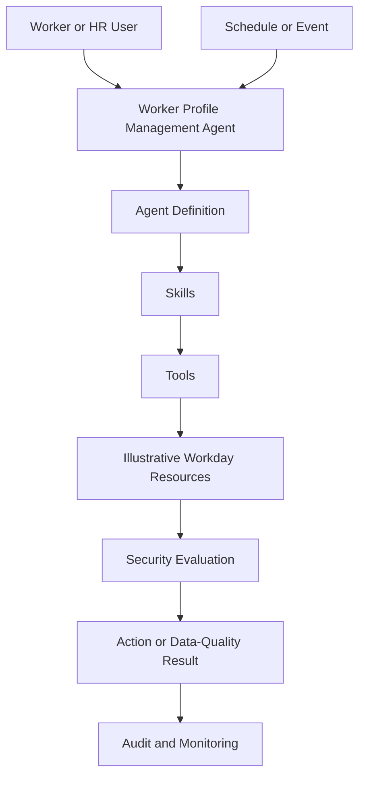

# Workday AI Worker Profile Management Agent

## Overview

This portfolio project presents a governance and security blueprint for a Worker Profile Management Agent in the Workday ecosystem.

It demonstrates how an enterprise AI agent can be described, secured, governed, tested, and audited across Delegate and Ambient execution modes. It uses synthetic data and illustrative configurations and does not connect to a live Workday tenant.

## Business Scenario

HR teams need a controlled way to retrieve worker information, request approved profile changes, and identify incomplete worker records.

| Skill | Mode | Purpose |
|---|---|---|
| Retrieve Worker Profile | Delegate | Retrieve information permitted for the requesting user |
| Update Worker Business Title | Delegate | Submit a validated and auditable title change |
| Monitor Worker Profile Data Quality | Ambient | Identify incomplete or invalid profile information |

## Objectives

- Demonstrate an illustrative Agent Definition.
- Map Skills to Tools and Workday resources.
- Compare Delegate and Ambient execution.
- Apply least-privilege security.
- Document interaction, domain, and business-process security.
- Provide synthetic requests, responses, validation results, and audit records.
- Define lifecycle, governance, testing, and monitoring controls.
- Present Mermaid diagrams and sanitized screenshot guidance.

## High-Level Architecture



## Execution Modes

### Delegate

Delegate Skills are initiated by a user. Execution requires both interaction access and the underlying permissions needed by the Tool or Workday resource.

```text
User
  -> Agent Interaction Policy
  -> Skill
  -> Tool
  -> Domain or Business Process Security
  -> Controlled Action
  -> Audit Record
```

### Ambient

The data-quality Skill runs from a schedule or event. The design uses an illustrative Ambient Agent System User and Ambient Agent Security Group.

```text
Schedule or Event
  -> Agent
  -> Ambient ASU
  -> Ambient Agent Security Group
  -> Data-Quality Skill
  -> Read-Only Evaluation
  -> Exception Report and Audit Record
```

## Security Principles

- Least privilege
- Separation of Skill access from Tool and API access
- Explicit authorization before worker-data retrieval
- Validation and approval controls for profile changes
- Read-only access for automated monitoring
- No credentials, secrets, tokens, private keys, or real worker data
- Traceable requests, decisions, results, and errors
- Sanitized screenshots and synthetic identifiers only

## Repository Structure

```text
agent-definition/  Agent Definition and field explanation
skills/            Skill designs and controls
tools/             Tool catalog and resource mapping
security/          Delegate, Ambient, interaction, and security matrices
docs/              Architecture, lifecycle, governance, and testing
diagrams/          GitHub-rendered Mermaid diagrams
samples/           Synthetic data, API examples, and audit records
screenshots/       Screenshot sanitization guidance
```
## Project Navigation

| Area | Artifacts |
|---|---|
| Agent Definition | [Definition JSON](agent-definition/agent-definition.json), [Field Explanation](agent-definition/agent-definition-explained.md) |
| Skills | [Retrieve Worker Profile](skills/retrieve-worker-profile.md), [Update Business Title](skills/update-worker-business-title.md), [Monitor Data Quality](skills/monitor-worker-profile-data-quality.md) |
| Tools | [Tool Catalog](tools/tool-catalog.json), [Resource Mapping](tools/api-and-resource-mapping.md) |
| Security | [Security Matrix](security/security-matrix.md), [Delegate Security](security/delegate-security.md), [Ambient Security](security/ambient-security.md), [Interaction Policy](security/agent-interaction-policy.md) |
| Architecture | [Architecture](docs/architecture.md), [Execution Modes](docs/execution-modes.md), [Agent Lifecycle](docs/agent-lifecycle.md) |
| Governance | [Governance Checklist](docs/governance-checklist.md), [Testing Strategy](docs/testing-strategy.md), [Interview Explanation](docs/interview-explanation.md) |
| Diagrams | [Agent Architecture](diagrams/agent-architecture.md), [Delegate Flow](diagrams/delegate-execution-flow.md), [Ambient Flow](diagrams/ambient-execution-flow.md), [Lifecycle](diagrams/agent-lifecycle.md) |
| Samples | [Worker Profile](samples/mock-worker-profile.json), [Retrieval Response](samples/retrieve-worker-response.json), [Title Update](samples/business-title-update-request.json), [Data-Quality Results](samples/data-quality-results.json), [Audit Records](samples/audit-records.json) |
| Screenshot Guidance | [Sanitization Checklist](screenshots/README.md) |

## Sample Artifacts

- Synthetic worker profile
- Worker retrieval response
- Business-title update request
- Data-quality exception results
- Audit records
- Tool and resource mappings
- Security and governance matrices

These examples are for learning and portfolio demonstration. They are not production Workday payloads or an official Workday schema.

## Project Status

Portfolio documentation complete. Live tenant implementation is not included.

## Author

Satyapal Singh<br>
Workday Integration Lead / Architect

## Disclaimer

This is an independent educational and portfolio project. It is not an official Workday product, implementation guide, certification artifact, or deployable Agent Definition. Product behavior, APIs, schemas, security configuration, and licensing must be validated against the documentation and tenant version available to an authorized customer.
