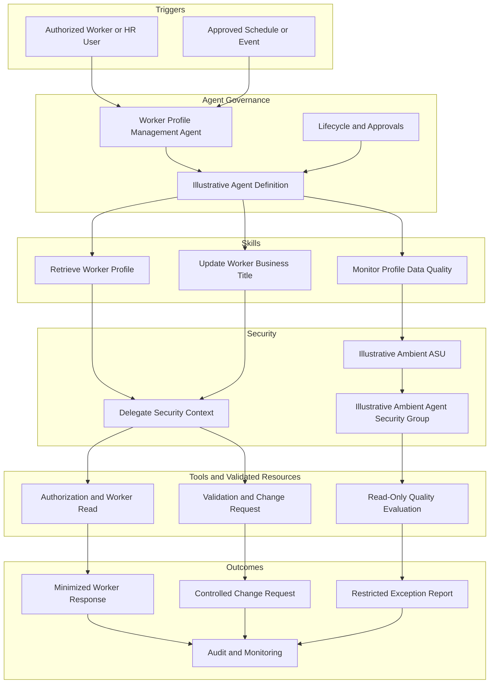

# Worker Profile Management Agent Architecture

## Design Boundaries

- Delegate Skills cannot expand the requesting user’s access.
- The title update preserves validation, confirmation, and approval routing.
- Ambient monitoring is read only.
- All resources and payloads are illustrative until validated.
- All portfolio worker records are synthetic.
