# Agent Lifecycle Diagram

```mermaid
stateDiagram-v2
&#x20;   \[\*] --> Idea
&#x20;   Idea --> Define: Business purpose accepted
&#x20;   Define --> Review: Design artifacts complete
&#x20;   Review --> Define: Changes required
&#x20;   Review --> Test: Reviews accepted
&#x20;   Test --> Define: Defect or control gap
&#x20;   Test --> Approve: Exit criteria satisfied
&#x20;   Approve --> Test: Evidence rejected
&#x20;   Approve --> Activate: Required approvals recorded
&#x20;   Activate --> Monitor: Smoke test successful
&#x20;   Activate --> Deactivate: Activation failure
&#x20;   Monitor --> Define: Controlled change
&#x20;   Monitor --> Deactivate: Retirement or unacceptable risk
&#x20;   Deactivate --> Archive: Execution disabled
&#x20;   Archive --> \[\*]
```

## Lifecycle Evidence

| State | Required evidence |
|---|---|
| Idea | Business problem, sponsor, and initial risk |
| Define | Agent Definition, Skills, Tools, security, privacy, and architecture |
| Review | Business, security, privacy, architecture, and operational review |
| Test | Functional, negative, security, audit, and recovery evidence |
| Approve | Recorded owner and reviewer approvals |
| Activate | Approved version, activation record, and smoke-test result |
| Monitor | Metrics, incidents, access reviews, and change history |
| Deactivate | Disablement decision and execution evidence |
| Archive | Final design, approvals, tests, incidents, and lessons learned |

## Version Rule

A material change to a Skill, Tool, execution mode, worker-data scope, identity, recipient, or security policy returns the agent to the Define state.
