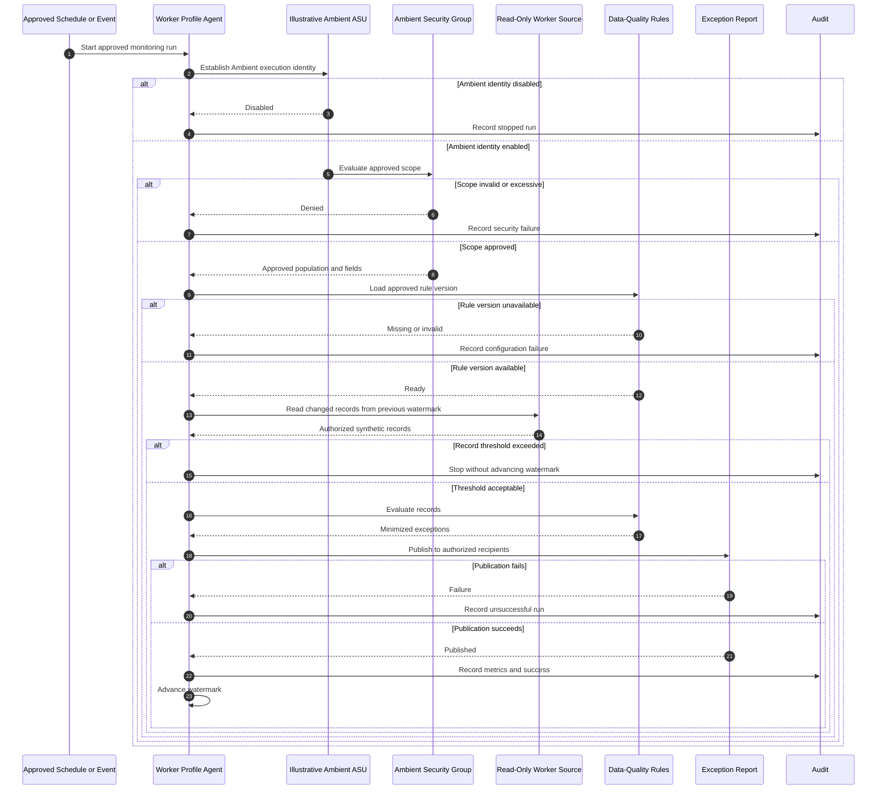

# Ambient Execution Flow

## Control Points

1. Approved trigger
2. Ambient identity state
3. Least-privilege security scope
4. Approved rule version
5. Restricted worker population
6. Maximum record threshold
7. Read-only evaluation
8. Authorized report recipients
9. Watermark advancement only after success
10. Complete audit and run metrics
