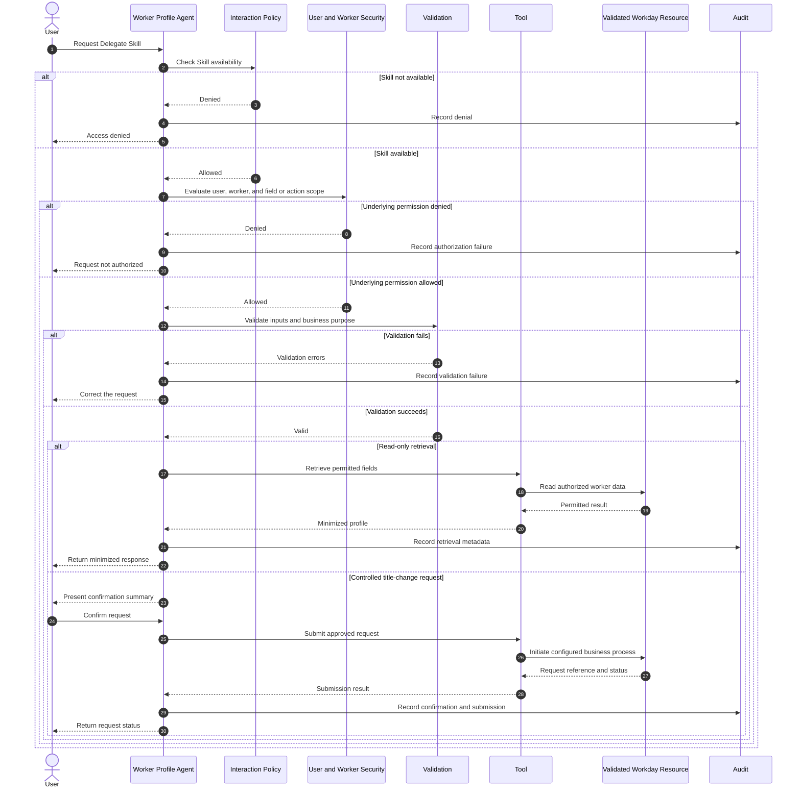

# Delegate Execution Flow

## Control Points

1. Skill availability
2. Target-worker authorization
3. Tool and resource permissions
4. Input and purpose validation
5. User confirmation for write requests
6. Configured approval routing
7. Minimized response
8. Audit record
