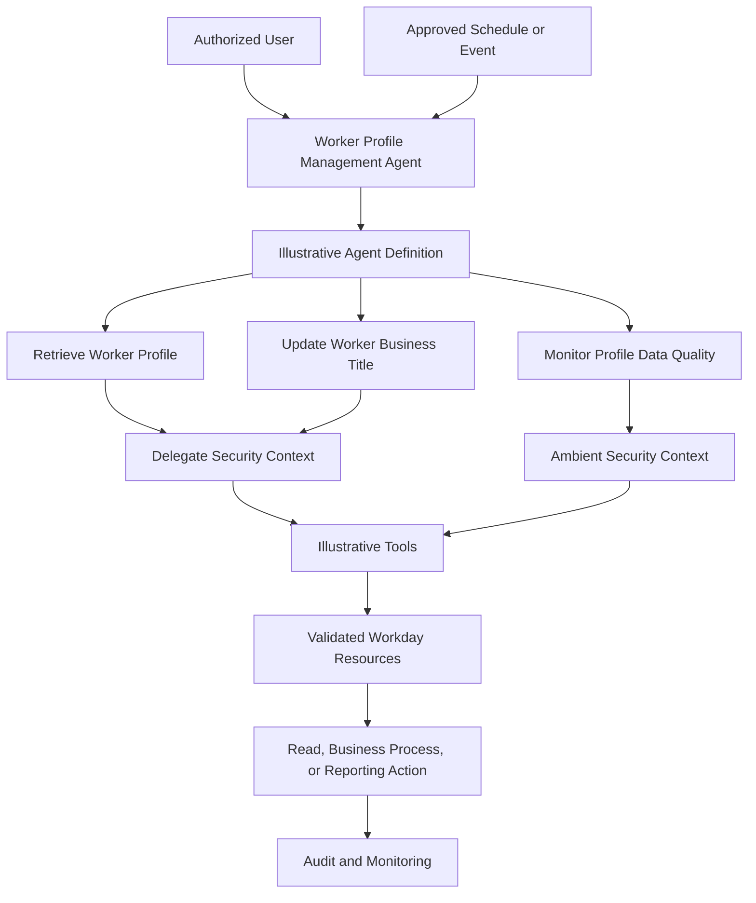
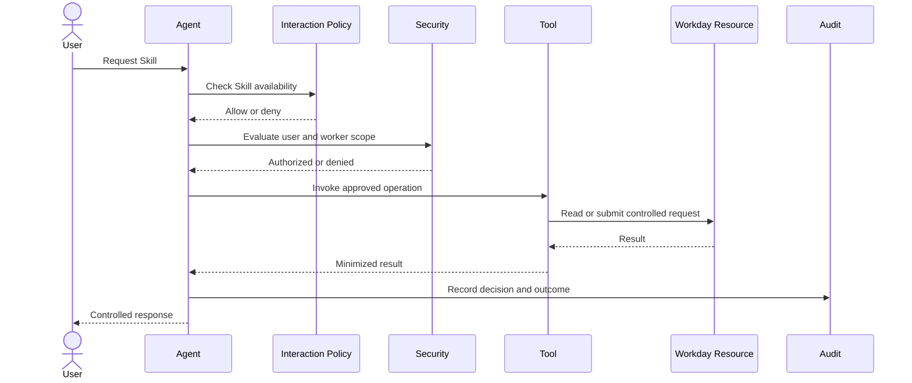
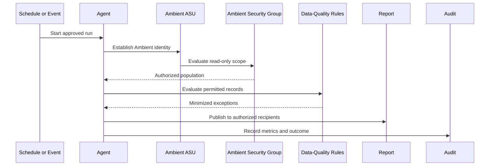

# Architecture

## Architecture Objective

The Worker Profile Management Agent is a portfolio blueprint for governed worker-data retrieval, controlled profile-change requests, and automated data-quality monitoring.

The design separates:

- User interaction
- Agent metadata
- Skills
- Tools
- Workday resources
- Security evaluation
- Business processes
- Reporting
- Audit and monitoring

## Logical Architecture



## Components

| Component | Responsibility |
|---|---|
| User or trigger | Initiates Delegate execution or starts an Ambient run |
| Agent | Coordinates the approved business interaction |
| Agent Definition | Describes metadata, capabilities, Skills, Tools, and governance |
| Skill | Defines a narrowly scoped business function |
| Tool | Provides the conceptual mechanism used by a Skill |
| Security context | Evaluates Delegate user access or Ambient identity permissions |
| Workday resource | Provides the validated read, business-process, or reporting operation |
| Audit service | Records decisions, outcomes, errors, and correlation metadata |
| Monitoring | Tracks operational health and control effectiveness |

## Delegate Architecture



## Ambient Architecture



## Trust Boundaries

| Boundary | Required control |
|---|---|
| User to agent | Authentication and interaction policy |
| Agent to Tool | Approved Skill-to-Tool mapping |
| Tool to resource | Domain or business-process security |
| Ambient identity to worker data | Least privilege and restricted population |
| Agent to report recipient | Recipient authorization and data minimization |
| All components to audit | Integrity, retention, and sensitive-data exclusion |

## Data Flow

### Retrieval

```text
User request
\-> authorization
\-> permitted field retrieval
\-> field minimization
\-> response
\-> audit metadata
```

### Title Update

```text
User request
\-> authorization
\-> validation
\-> confirmation
\-> business-process submission
\-> approval routing
\-> status response
\-> audit metadata
```

### Data-Quality Monitoring

```text
Schedule or event
\-> Ambient authorization
\-> restricted worker read
\-> rule evaluation
\-> exception minimization
\-> restricted report
\-> run metrics and audit
```

## Architecture Constraints

- No live Workday connection is included.
- No official Workday endpoint or schema is asserted.
- All worker records are synthetic.
- No credentials or secrets are stored.
- Ambient execution is read only.
- High-risk changes preserve validation and approvals.
- Existing repository content remains unchanged.
