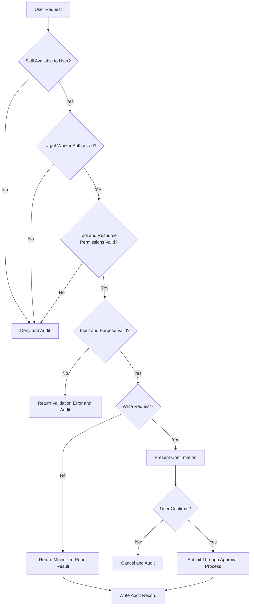
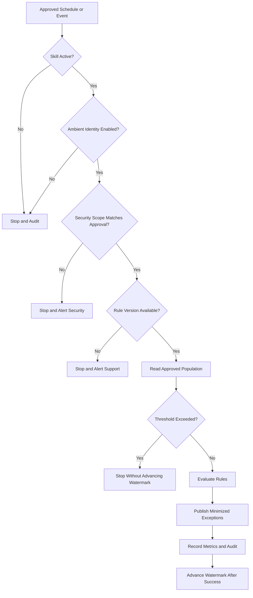

# Execution Modes

## Overview

The project demonstrates both Delegate and Ambient execution.

| Mode | Trigger | Security context | Project Skills |
|---|---|---|---|
| Delegate | User request | User permissions combined with agent and Skill controls | Retrieve Worker Profile; Update Worker Business Title |
| Ambient | Approved schedule or event | Illustrative Ambient ASU and Ambient Agent Security Group | Monitor Worker Profile Data Quality |

## Delegate Mode

Delegate mode is appropriate when a user intentionally asks the agent to perform an action.

The project uses Delegate mode when:

- A worker or authorized HR user retrieves permitted profile information.
- An authorized user requests a business-title change.

### Delegate Decision Logic

## Ambient Mode

Ambient mode is appropriate for an approved background activity that is not initiated by a user for every run.

The project uses Ambient mode to identify worker-profile data-quality exceptions.

### Ambient Decision Logic

## Comparison

| Area | Delegate | Ambient |
|---|---|---|
| Immediate user involved | Yes | No |
| Trigger | User request | Schedule or event |
| Interaction policy | Required | Not the primary access mechanism |
| Underlying security | User and resource permissions | Ambient identity permissions |
| Confirmation | Required for high-risk write requests | Not applicable to the read-only monitoring run |
| Write permission in this project | Controlled request only | None |
| Primary audit subject | User request and agent action | Run, identity, scope, and exceptions |
| Emergency control | Disable Skill or access | Disable or pause Ambient execution |

## Selection Rationale

### Retrieve Worker Profile

Selected mode: Delegate

Reason: A user requests worker information for an immediate business purpose. The result must be evaluated against that user’s permissions.

### Update Worker Business Title

Selected mode: Delegate

Reason: A user intentionally initiates a high-risk worker-data change that requires confirmation and approval routing.

### Monitor Worker Profile Data Quality

Selected mode: Ambient

Reason: The activity runs repeatedly against an approved scope and produces a read-only exception report without changing worker records.

## Governance Requirement

A change in execution mode requires a new security, privacy, testing, monitoring, and business-owner review. Delegate and Ambient modes must not be treated as interchangeable.
