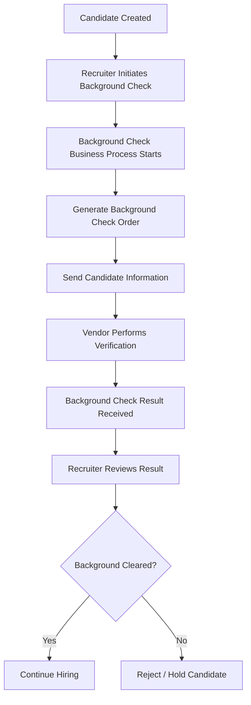

# Business Flow

---

# Overview

The Background Check Business Process automates candidate verification after the recruiting process reaches the background verification stage.

The process ensures every candidate follows a standardized workflow before proceeding to the next hiring stage.

---

# Business Objective

The primary objectives of this implementation are:

* Automate background verification requests.
* Eliminate manual recruiter activities.
* Standardize hiring workflows.
* Improve hiring compliance.
* Increase recruiter productivity.
* Reduce hiring cycle time.

---

# End to End Business Flow

---

# Recruiter Activities

The recruiter performs the following activities:

* Submit candidate.
* Initiate background verification.
* Monitor background check status.
* Review completed verification.
* Continue hiring process.
* Resolve exceptions if required.

---

# Workday Activities

Workday automatically performs:

* Starts Business Process.
* Generates outbound request.
* Applies routing rules.
* Executes integration.
* Sends notifications.
* Updates candidate status.
* Records audit history.

---

# Vendor Activities

The external background verification vendor:

* Receives candidate information.
* Performs verification.
* Validates candidate records.
* Completes background screening.
* Returns verification status.

---

# Decision Points

Decision Point 1

Should background verification start?

Decision Point 2

Did integration complete successfully?

Decision Point 3

Did vendor complete verification?

Decision Point 4

Did candidate pass verification?

---

# Notifications

Notifications are sent to:

* Recruiter
* Hiring Manager
* HR Partner
* Security Administrator (if configured)

---

# Business Rules

Typical rules include:

* Candidate must reach configured recruiting stage.
* Required candidate information must be available.
* Background verification cannot start twice.
* Recruiter permissions must be validated.
* Integration must complete successfully before proceeding.

---

# Exception Handling

Possible exceptions include:

* Missing candidate information
* Vendor unavailable
* Integration failure
* XML validation error
* Security access denied
* Duplicate background request

---

# Expected Outcome

After successful completion:

* Candidate status updated.
* Recruiter notified.
* Audit trail maintained.
* Hiring process continues.
* Compliance requirements satisfied.

---

# Related Documents

* README.md
* Architecture.md
* Technical_Design.md
* Deployment_Guide.md

