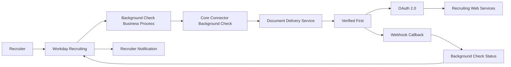
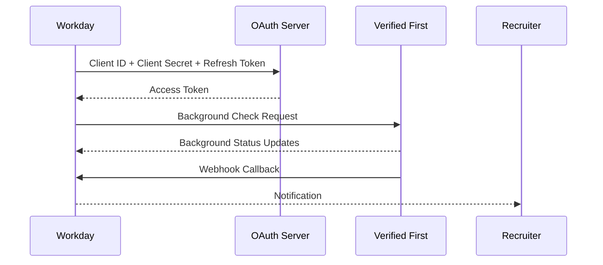

# Architecture

---

# Overview

The Verified First E Verify Integration establishes secure communication between Workday Recruiting and the Verified First background screening platform using Workday Web Services, OAuth 2.0 authentication, Background Check Connector, Document Delivery Services, and Webhooks.

The architecture enables automated background check ordering, secure data transmission, real-time status synchronization, and recruiter notifications while maintaining enterprise security standards.

---

# High Level Architecture

---

# Authentication Flow

---

# Major Components

## Workday Recruiting

Responsible for initiating candidate background verification and maintaining recruiting workflow.

---

## Background Check Business Process

Controls routing, approvals, notifications, integration execution, and candidate lifecycle.

---

## Integration System User (ISU)

Dedicated service account used by external integrations.

---

## Integration System Security Group (ISSG)

Provides secure access to Workday domains and APIs required by the integration.

---

## OAuth 2.0 API Client

Responsible for secure authentication between Workday and Verified First.

Configured using:

- Client ID
- Client Secret
- Refresh Token
- Access Token
- Token Endpoint
- Authorization Endpoint

---

## Recruiting Web Services

Provides SOAP-based Workday APIs used by Verified First.

---

## Background Check Connector

Generates XML payloads for candidate background verification requests.

---

## Document Delivery Service

Transfers outbound XML payloads securely to Verified First.

---

## Verified First Platform

Processes candidate verification requests and performs:

- Identity Verification
- Employment Verification
- Criminal Screening
- Background Investigation
- E Verify Processing

---

## Webhooks

Used for real-time callback events from Verified First to Workday.

Webhook events include:

- Pending
- Completed
- No Longer Applies

---

# Security Architecture

Security includes:

- Integration System User
- Integration System Security Group
- OAuth 2.0
- Domain Security Policies
- API Authentication
- Role-Based Access Control

---

# Data Flow

1. Recruiter initiates Background Check.

2. Workday Business Process starts.

3. Background Check Connector generates XML.

4. OAuth Access Token generated.

5. XML transmitted securely.

6. Verified First processes request.

7. Webhook callback received.

8. Candidate status updated.

9. Recruiter notified.

---

# Design Principles

- Secure authentication
- Minimal manual effort
- Enterprise scalability
- Standard Workday configuration
- Real-time synchronization
- Vendor interoperability

---

# Business Benefits

- Automated background verification
- Secure API authentication
- Faster hiring process
- Reduced manual effort
- Improved compliance
- Real-time status visibility
- Better recruiter experience

---

# Related Documents

- README.md
- Business_Flow.md
- Technical_Design.md
- Deployment_Guide.md
- Troubleshooting.md

