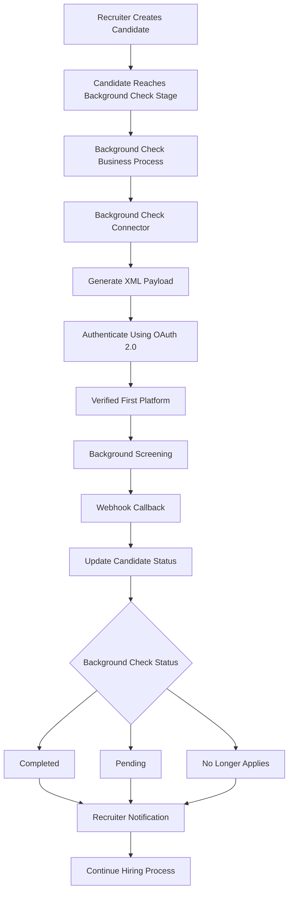

# Business Flow

---

# Overview

The Verified First E Verify Integration automates the background screening lifecycle by securely connecting Workday Recruiting with the Verified First platform.

The solution enables recruiters to initiate background checks directly from Workday while leveraging OAuth 2.0 authentication, API-based communication, Background Check Connector, and webhook callbacks to synchronize candidate verification status.

---

# Business Objective

The implementation aims to:

- Eliminate manual background verification requests.
- Securely exchange candidate information.
- Automate recruiter workflows.
- Reduce hiring turnaround time.
- Improve compliance and auditability.
- Provide real-time background check status updates.

---

# End-to-End Business Flow

---

# Recruiter Activities

The recruiter is responsible for:

- Initiating the background check.
- Monitoring candidate status.
- Reviewing verification results.
- Taking hiring decisions.
- Managing exception scenarios.

---

# Workday Activities

Workday performs the following automatically:

- Starts the Background Check Business Process.
- Generates outbound XML payload.
- Authenticates using OAuth 2.0.
- Sends candidate information.
- Receives webhook callbacks.
- Updates background check status.
- Notifies recruiters.

---

# Verified First Activities

Verified First:

- Receives candidate information.
- Authenticates requests.
- Performs background verification.
- Executes E Verify checks.
- Returns background status.
- Sends webhook notifications.

---

# Status Mapping

Supported background verification statuses include:

- Pending
- Completed
- No Longer Applies

These statuses are synchronized with Workday Recruiting to keep recruiters informed of the verification progress.

---

# Authentication Flow

Authentication process:

1. API Client Registration
2. Client ID Generation
3. Client Secret Generation
4. Refresh Token Creation
5. Access Token Generation
6. Secure API Communication

---

# Integration Flow

1. Recruiter submits candidate.
2. Background Check Business Process starts.
3. Background Check Connector generates XML.
4. OAuth Access Token is obtained.
5. Candidate information is transmitted securely.
6. Verified First processes the request.
7. Webhook callback is received.
8. Candidate status is updated.
9. Recruiter receives notification.
10. Hiring process continues.

---

# Business Rules

- Candidate must reach the configured recruiting stage.
- Required candidate information must be available.
- OAuth authentication must succeed before transmission.
- Background check cannot be initiated multiple times for the same request.
- Only authorized users can initiate or manage background checks.

---

# Exception Scenarios

Possible exceptions include:

- OAuth authentication failure.
- Invalid API credentials.
- Webhook delivery failure.
- XML validation failure.
- Missing candidate information.
- Vendor service unavailable.
- Security authorization failure.

---

# Business Benefits

- Automated background verification.
- Reduced recruiter effort.
- Improved hiring efficiency.
- Real-time candidate status updates.
- Secure API authentication.
- Standardized recruiting process.
- Improved compliance and audit history.

---

# Related Documents

- README.md
- Architecture.md
- Technical_Design.md
- Deployment_Guide.md
- Troubleshooting.md

